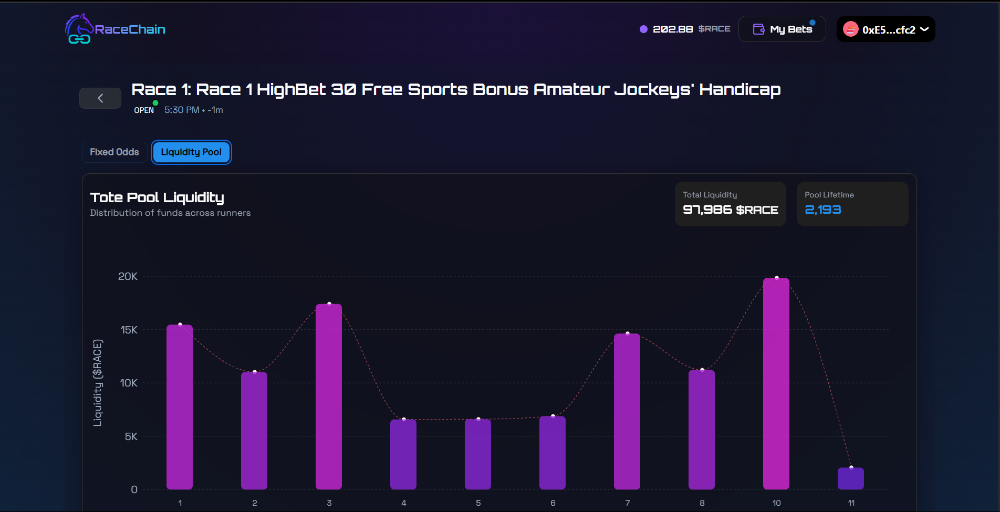

# RaceChain - On-Chain Horse Race Betting Platform



## Overview

RaceChain revolutionizes online horse race betting by bringing it fully on-chain using smart contracts, AI-generated fixed odds, and decentralized liquidity pools. By reducing traditional platform fees from ~10% to 1%, ensuring full transparency, and leveraging the scalability of Block DAG infrastructure, RaceChain creates a trustless, fast, and fair betting experience for a global audience.

**Key Features**:
- 🏇 AI-powered odds generation using historical data
- 💸 Only 1% platform fees (vs traditional 10-15%)
- 🔒 Fully on-chain betting with smart contracts
- ⚡ Block DAG infrastructure for high scalability
- 🌐 Global access to horse racing markets
- 💰 Decentralized liquidity pools
- 📊 Transparent betting history and results

## Table of Contents
- [Installation](#installation)
- [Usage](#usage)
- [Technology Stack](#technology-stack)
- [Project Structure](#project-structure)
- [License](#license)

## Installation

### Prerequisites
- Node.js (v18+)
- npm (v9+)
- Hardhat
- Git

### Setup Instructions

1. **Clone the repository**:
   ```bash
   git clone [https://github.com/your-username/RaceChain.git](https://github.com/TinoDCodes/Simuka-DRace-BlockDAG-Hackathon-dApp.git)
   cd Simuka-DRace-BlockDAG-Hackathon-dApp
   ```

2. **Set up the smart contract environment (dApp folder)**:
   ```bash
   cd dApp
   npm install
   ```

3. **Set up the frontend (frontend folder)**:
   ```bash
   cd ../frontend
   npm install
   ```

4. **Configure environment variables**:
   - Create `.env` files in both `dApp` and `frontend` directories based on the provided `.env.example` files
   - Add your Infura/Alchemy API keys, wallet private key (for deployment), and other required secrets
   - Create a parameters.json file in the ignition folder and populate it with the relevant parameters for contract deployment. (see hardhat ignition docs)

5. **Compile and deploy smart contracts**:
   ```bash
   cd ../dApp
   npx hardhat compile
   npx hardhat ignition deploy .\ignition\modules\<deployment-module> --network primordial --parameters .\ignition\<path-to-parameters-file>
   ```

## Usage

### Running the Development Environment

1. **Start the local blockchain (in dApp folder)**:
   ```bash
   cd dApp
   npx hardhat node
   ```

2. **Deploy contracts to local network**:
   ```bash
   npx hardhat ignition deploy .\ignition\modules\<deployment-module> --network localhost --parameters .\ignition\<path-to-parameters-file>
   ```

3. **Start the frontend development server (in frontend folder)**:
   ```bash
   cd ../frontend
   npm run dev
   ```

4. **Access the application**:
   Open your browser and navigate to `http://localhost:3000`

### Production Build

1. **Build the frontend**:
   ```bash
   cd frontend
   npm run build
   ```

2. **Start the production server**:
   ```bash
   npm run start
   ```

## Technology Stack

### Smart Contracts (dApp folder)
- **Solidity**: For writing smart contracts
- **Hardhat**: Development environment for Ethereum
- **Ethers.js & Hardhat Ignition**: Interacting with Ethereum blockchain
- **Mocha**: Smart contract testing
- **OpenZeppelin**: Secure smart contract libraries

### Frontend (frontend folder)
- **Next.js**: React framework for server-rendered applications
- **Tailwind CSS**: Utility-first CSS framework
- **Wagmi**: React hooks for Ethereum
- **Hero UI**: Component library
- **Recharts**: Data visualization library
- **Framer Motion**: Animation library
- **RainbowKit**: Wallet adapter library

### Infrastructure
- **Block DAG**: Scalable blockchain infrastructure
- **IPFS**: Decentralized file storage
- **The Graph**: Decentralized query protocol
- **Chainlink Oracles**: Real-world data integration

## Project Structure

```
RaceChain/
├── dApp/                   # Smart contract project
│   ├── contracts/          # Solidity smart contracts
│   ├── scripts/            # Custom scripts
│   ├── ignition/           # Ignition modules
│   ├── typechain-types/    # Typescript factories and helpers
│   ├── test/               # Smart contract tests
│   ├── hardhat.config.js   # Hardhat configuration
│   └── package.json
│
├── frontend/               # Next.js application
│   ├── public/             # Static assets
│   ├── app/                # Next.js pages, layouts & api routes
│   ├── components/         # React components
│   ├── hooks/              # Custom hooks
│   ├── utils/              # Utility functions & files
│   │   └── ...             
│   ├── next.config.js      # Next.js configuration
│   └── package.json
│
├── LICENSE
└── README.md                # This file
```

## License

RaceChain is released under the [MIT License](LICENSE).

```text
MIT License

Copyright (c) 2023 RaceChain

Permission is hereby granted, free of charge, to any person obtaining a copy
of this software and associated documentation files (the "Software"), to deal
in the Software without restriction, including without limitation the rights
to use, copy, modify, merge, publish, distribute, sublicense, and/or sell
copies of the Software, and to permit persons to whom the Software is
furnished to do so, subject to the following conditions:

The above copyright notice and this permission notice shall be included in all
copies or substantial portions of the Software.

THE SOFTWARE IS PROVIDED "AS IS", WITHOUT WARRANTY OF ANY KIND, EXPRESS OR
IMPLIED, INCLUDING BUT NOT LIMITED TO THE WARRANTIES OF MERCHANTABILITY,
FITNESS FOR A PARTICULAR PURPOSE AND NONINFRINGEMENT. IN NO EVENT SHALL THE
AUTHORS OR COPYRIGHT HOLDERS BE LIABLE FOR ANY CLAIM, DAMAGES OR OTHER
LIABILITY, WHETHER IN AN ACTION OF CONTRACT, TORT OR OTHERWISE, ARISING FROM,
OUT OF OR IN CONNECTION WITH THE SOFTWARE OR THE USE OR OTHER DEALINGS IN THE
SOFTWARE.
```

---

**RaceChain** is developed by Simuka Solutions - Bringing transparency and fairness to the $120B+ horse racing industry through blockchain technology.
